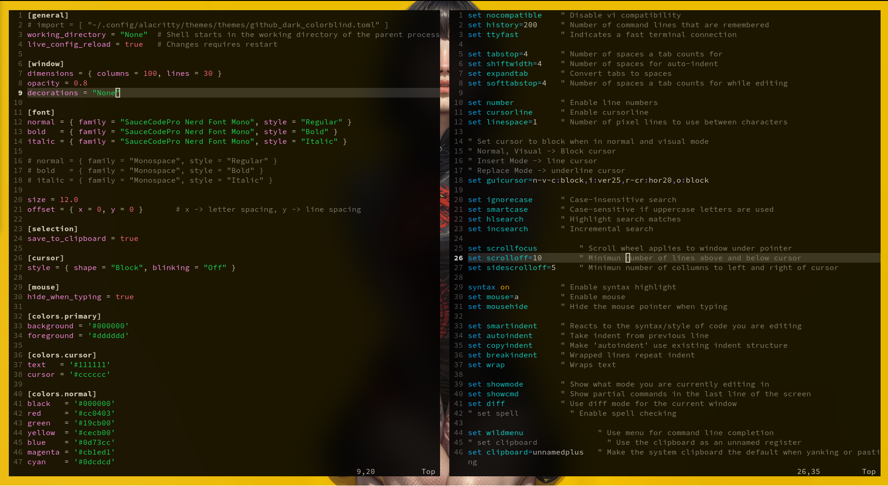

# My Dotfiles



This repository contains my personal configuration files (dotfiles) for a consistent and efficient development environment across different machines.  

It includes configurations for **Bash**, **Vim**, **Neovim**,
**Alacritty terminal**, **Ghostty**, **Tmux** and a directory with
a collections of wallpapers.

---

## 📂 Included Files

| File / Directory | Description |
|-----------------|-------------|
| `.bashrc` | Custom Bash shell configuration including aliases, environment variables, and prompt settings. |
| `.vimrc` | Minimal vim configuration without any plugins. |
| `/nvim`  | Minimal neovim configuration with basic plugins. Current version disables mosts plugins, keeping only the essentials for an easy to use and configure experience.  |
| `tmux.conf` | Configuration file for tmux. | 
| `alacritty.toml` | Alacritty terminal emulator configuration including colors, fonts, and scrolling behavior. |
| `ghostty.conf` | Ghostty terminal emulator configuration file. | 
| `/Wallpapers` | A collection of desktop wallpapers

---

## 🖥️ Tmux Configuration

This repository includes a `tmux.conf` with custom keybindings, status bar settings, and terminal optimizations for a smooth workflow. Below is a breakdown of the main keybindings and settings.

Prefix = `Ctrl + a`

---

### 🔹 Pane Navigation (Alt + HJKL)

| Keybinding | Action |
|------------|--------|
| `M-h`      | Select left pane |
| `M-j`      | Select pane below |
| `M-k`      | Select pane above |
| `M-l`      | Select right pane |

> `M-` stands for **Alt / Meta key**.

---

### 🔹 Window Splits

| Keybinding | Action |
|------------|--------|
|  `Prefix + \|`        | Split pane **horizontally** in the current path (`-hc "#{pane_current_path}"`) |
| `Prefix + -`        | Split pane **vertically** in the current path (`-vc "#{pane_current_path}"`) |

---

### 🔹 Window Switching (Alt + Number)

| Keybinding | Action |
|------------|--------|
| `M-1`      | Select window 1 |
| `M-2`      | Select window 2 |
| `M-3`      | Select window 3 |
| `M-4`      | Select window 4 |

---

## 🚀 Installation

Clone the repository:

```bash
git clone --depth=1 https://github.com/yourusername/dotfiles.git ~/.dotfiles
```

Set up sym-links
```bash
# Wallpappers
mkdir -p ~/Pictures/
cp ~/.dotfiles/Wallpapers ~/Pictures/

ln -sf ~/.dotfiles/.bashrc ~/.bashrc
ln -sf ~/.dotfiles/.vimrc ~/.vimrc
```

```bash
mkdir -p ~/.config/nvim
ln -sf ~/.dotfiles/nvim/* ~/.config/nvim/
```

Alacritty
```bash
# Alacritty
mkdir -p ~/.config/alacritty
ln -sf ~/.dotfiles/alacritty.toml ~/.config/alacritty/alacritty.toml
```

Ghostty
```bash
#Ghostty
mkdir -p ~/.config/ghostty/
ln -sf ~/.dotfiles ghostty.conf ~/.config/ghostty/config
```
